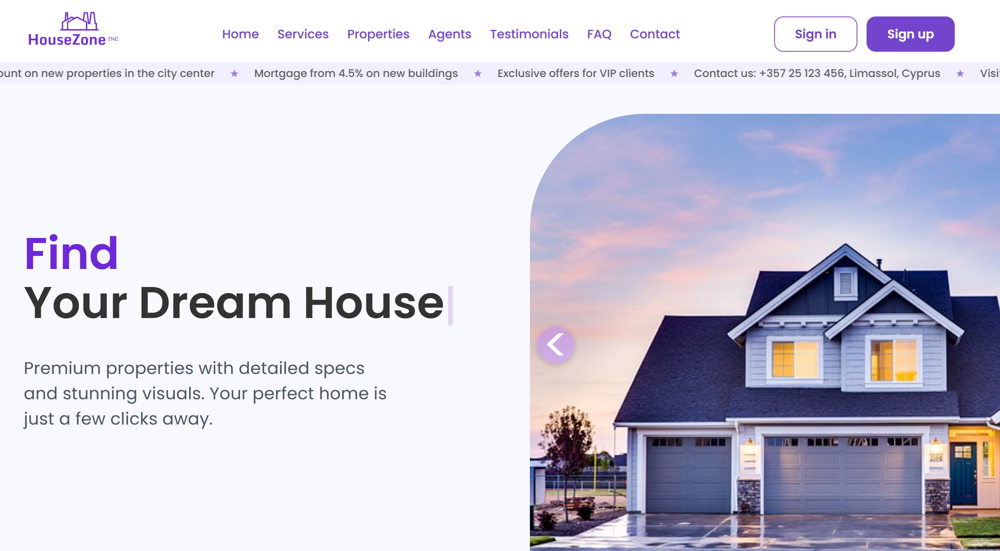

# <span align="left"> <a href="https://developer.mozilla.org/en-US/docs/Web/JavaScript" target="_blank" rel="noreferrer">  <a href="https://developer.mozilla.org/en-US/docs/Web/JavaScript" target="_blank" rel="noreferrer">   </a> <a href="https://reactjs.org/" target="_blank" rel="noreferrer">  </a> </a> <a href="https://reactjs.org/" target="_blank" rel="noreferrer">  </a> <a href="https://swiperjs.com/" target="_blank" rel="noreferrer">  </a> </span>

# Real Estate Website



### [Public link] https://currency-converter-api-app-mvp.netlify.app/)

### Author

- Volodymyr Babiichuk - https://volodymyrcodepro.online/
- LinkedIn - https://www.linkedin.com/in/frontend-volodymyr-babiichuk/

# Збірка Vite.js + vituum

- Перед встановленням збірки перевірте, чи ви встановили node.js (LTS-версію)
[завантажити nodejs з офіційного сайту](https://nodejs.org/en/download).

- Встановлення залежностей
```
npm install
```

- Запуск збірки/сервера
```
npx vite
```

- Збірка проєкта
```
npx vite build
```
